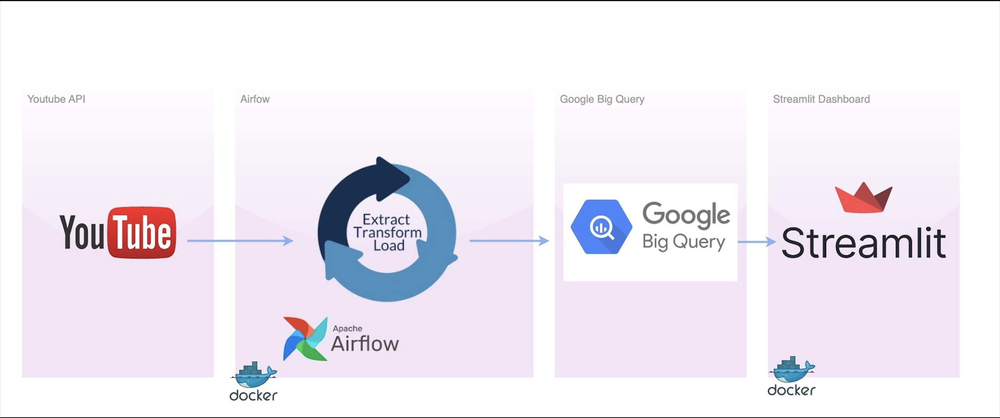
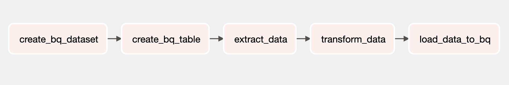
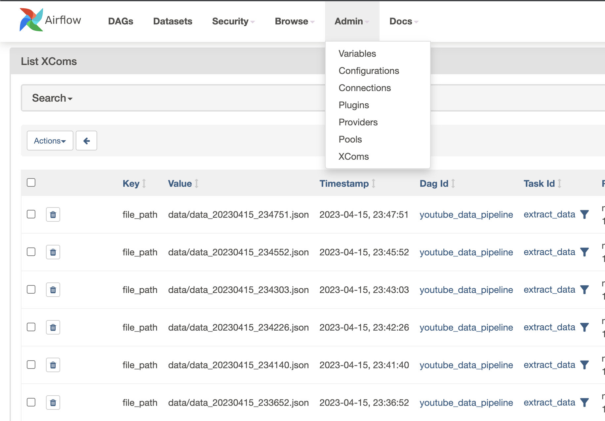
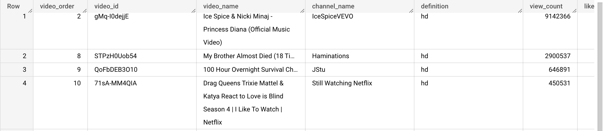
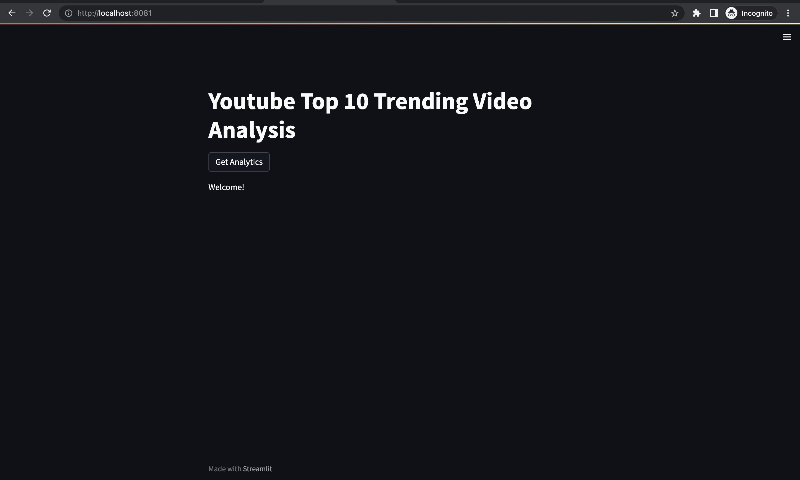
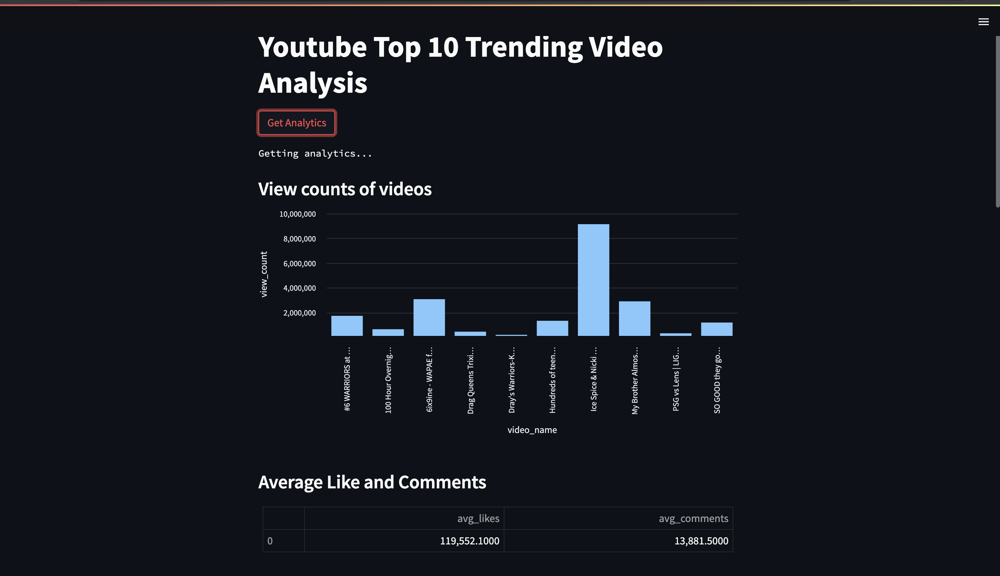
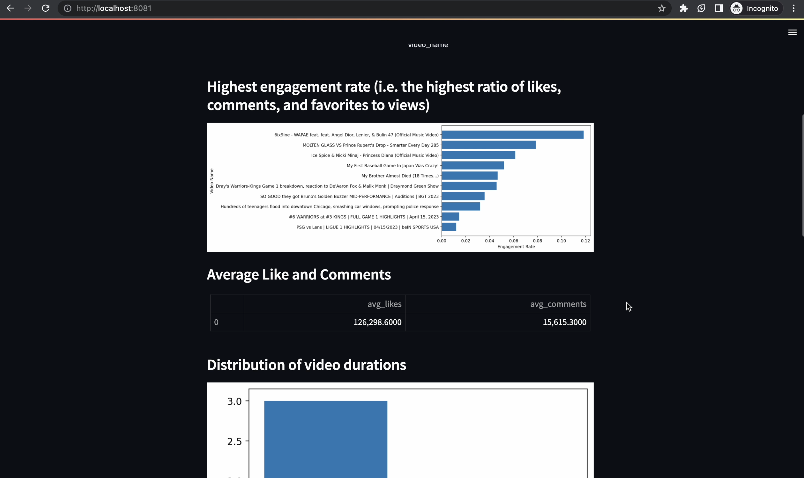
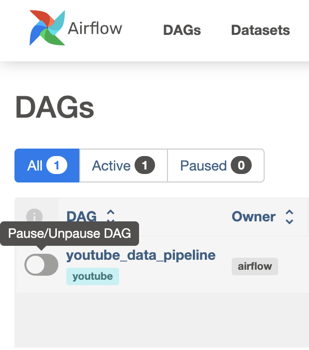

# Youtube Top 10 Trending Analysis Tool

## Goal Description
The goal of this project is to create a tool that will automatically collect data on the most popular videos on YouTube, and display this information in an easy-to-use dashboard with visualisations. This tool will also help to organize and analyze the data, so users can gain insights into what makes a video popular on YouTube. The dashboard will be user-friendly and will allow people to explore the data in a simple and intuitive way.
## Tech Stack

**Youtube API:** YouTube API is used to collect data on the **most popular 10 videos** on YouTube. This data will be used to analyze trends and gain insights into what makes a video popular on the platform.

**Airflow:** Airflow is used to manage the **ETL** pipeline and it will help automate the process of collecting data, transforming it, and loading it into a Database.

**BigQuery:** BigQuery is used to store and organize the data collected from the API. It will allow users to easily access and analyze the data, and provide a scalable solution for handling the data.

**Streamlit:** Streamlit is used to create a user-friendly dashboard that will allow users to explore the data collected from the API and stored in BigQuery. Streamlit will provide a simple and intuitive interface for users to interact with the data and gain insights into video trends on YouTube.

**Docker:** Used for containerization.

## Project structure

<p align="center"></p>

The project workflow follows the structure above.

## Demo
[**Demo**](https://youtu.be/SaCHTM--qbg "channel") video is available on my youtube channel.
  
## Explanations

### Airflow
<p align="center"></p>

___
The Airflow instance in this project is running within a Docker container.

The DAG is named "**youtube_data_pipeline**" and is described as an analysis of the top 10 trending videos on YouTube.

* The DAG is scheduled to run only once, with `schedule_interval=None`. 
  - It developed to be a manually triggered DAG.
* The DAG: The DAG has 5 tasks, with each task represented by a PythonOperator:
    * `create_bq_dataset`: This task **creates a new dataset in BigQuery** if it does not already exist.
    * `create_bq_table`: This task **creates a new table in the BigQuery** dataset created by create_bq_dataset()  if it does not already exist..
    * `extract_data`: This task **uses the YouTube API to extract data** on the top 10 trending videos and saves it to a JSON file.
        - Once data obtained it saved into ./data folder in JSON format for future needs. 
    * `transform_data`: This task **applies some transformation** to the data saved in the JSON file created by `extract_data()` and saves the transformed data back to the same file.
    * `load_data_to_bq`: This task **loads the transformed data** from the JSON file created by transform_data() **into the BigQuery** table created by `create_bq_table()`.
* The tasks are **connected in a linear dependency**, with `create_bq_dataset` >> `create_bq_table` >> `extract_data` >> `transform_data` >> `load_data_to_bq`.
* When the DAG is triggered, it first runs the `create_bq_dataset` task, which creates a new dataset in BigQuery.
* After `create_bq_dataset` successfully completes, the `create_bq_table` task runs and creates a new table in the BigQuery dataset created by `create_bq_dataset()`.
* Once `create_bq_table` successfully completes, the `extract_data` task runs and uses the YouTube API to extract data on the top 10 trending videos and saves it to a JSON file.
* After `extract_data` successfully completes, the `transform_data` task runs and applies some transformation to the data saved in the JSON file created by `extract_data()` and saves the transformed data back to the same file.
* Once `transform_data` successfully completes, the `load_data_to_bq` task runs and loads the transformed data from the JSON file created by `transform_data()` into the BigQuery table created by `create_bq_table()`.
* Once all tasks have successfully completed, the DAG run is considered successful and is marked as such in the Airflow UI.

#### XCOMs
<p align="center"></p>

In this project **XCOMs** are used for communication between task to make them know the file paths.

### Google Cloud BigQuery
* Data sample in BigQuery
<p align="center"></p>

#### Analytics - SQLs 

- **Most viewed videos**
```SQL
    SELECT video_name, view_count
    FROM {table_name}
    ORDER BY view_count DESC
    LIMIT 10;
```

- **Highest engagement rate (i.e. the highest ratio of likes, comments, and favorites to views)**
```SQL
    SELECT video_name, (like_count + comment_count + favorite_count) / view_count as engagement_rate
    FROM {table_name}
    ORDER BY engagement_rate DESC
    LIMIT 10;
```

- **Average Like and Comments**
```SQL
    SELECT AVG(like_count) as avg_likes, AVG(comment_count) as avg_comments
    FROM {table_name}
```

- **Distribution of video durations**
```SQL
    SELECT duration_in_sec
    FROM {table_name}
    ORDER BY duration_in_sec ASC;
```

- **Correlation between video length and engagement**
```SQL
    SELECT duration_in_sec, AVG(like_count) as avg_likes, AVG(comment_count) as avg_comments
    FROM {table_name}
    GROUP BY duration_in_sec
    ORDER BY duration_in_sec ASC;
```

- **Video popularity by channel**
```SQL
    SELECT channel_name, SUM(view_count) as total_views
    FROM {table_name}
    GROUP BY channel_name
    ORDER BY total_views DESC
    LIMIT 10;
```

### Streamlit
<p align="center"></p>

___
<p align="center"></p>

___

<p align="center"></p>

___
The Streamlit instance in this project is running within a Docker container.

#### How Does It Work?
Once the user clicks the "*Get Analytics*" button:
* The app then starts an external trigger which triggers an Airflow DAG to start running and retrieving data from YouTube API, transforming it and loading it into BigQuery.
* Once DagRun is finished the app makes request to BigQuery for the updated data.
When the data has arrived, top ten most viewed videos, average number of likes and comments, highest engagement rate, video duration distribution, correlation between video length and engagement, and video popularity analytics data are used for the visualisations.

## Running
* **Docker**
* **GCP Account**
Are the **prerequisites**.
1. **Clone the repository into a new local directory.**

2. **Get a Service Account for BigQuery.**
    - Service Account is a .json file that stores the necessery credentials for auth.
    - It is important so make sure you save the .json file.
    - Check out this helpful website: https://docs.openbridge.com/en/articles/1856793-how-to-set-up-google-bigquery-creating-and-configuring-service-accounts-in-google-cloud-console

3. **Get a Youtube API key.**
  - Youtube API key is important. Once you got it please note it down.
  - Check out this helpful website : https://blog.hubspot.com/website/how-to-get-youtube-api-key

4. **Change the name of your original Service Account file(.json) to "*credentials.json*" and copy it to:**
- ./credentials/
- ./streamlit/credentials/
folders.

5. **Open the "*env.env*" file. Within this file, you will find a variable named `YOUTUBE_API_KEY` that currently has no assigned value.**
- To proceed, insert your personal YouTube API key(step3) inside the double quotation marks provided for this variable
- `YOUTUBE_API_KEY=""` 
* By completing this step, you will be able to utilize your own YouTube API key.

6. **Go to project directory from your terminal.**
7. **Write,**
```bash
  docker compose --env-file env.env up airflow-init
```

8. **Once it completed write,** 
```bash
  docker compose --env-file env.env up -d
````

9. **After a few seconds the instances should be up. You can see the airflow's `airflow-webserver` , `airflow-scheduler` and `youtube/streamlit:trending` by using the command,**

```bash
  docker ps
```

10. **Got to Airflow Web UI**
- **http://localhost:8080**

11. **Login with,**
`Username: airflow`
`Pasword: airlfow`

12. **Unpause your dag by changing the state of toggle button.**
<p align="center"></p>

13. **Got to Streamlit UI**
- **http://localhost:8081**

14. **Finally, press the button and get the analytics..:)**

### Access

- **Airflow Web UI** is accessible from **http://localhost:8080**
- **Streamlit web page** is accessible from **http://localhost:8081**


## Important

**Please note that this project is still in development and may contain bugs or leaks. It has not been developed to with the aim of rigor as professional-grade software.**

- Remember **when you press the get analytic button**, **all system explained above is repeating**. Therefore you may **consider to not use it oftenly**. 

- You may **clear XCOMs** periodically from the AirflowUI/Admin/XCOMs

- When your job is done, make sure to use,
```bash
  docker compose down
```
command for preventing resource issues. It also helps to stop and remove containers, networks, images, and volumes.

- **Also in the ./data folder you can see the API data(.json files) which was stored for future needs. You may consider to delete it.**

